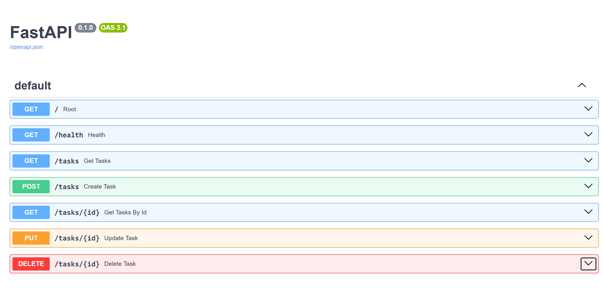
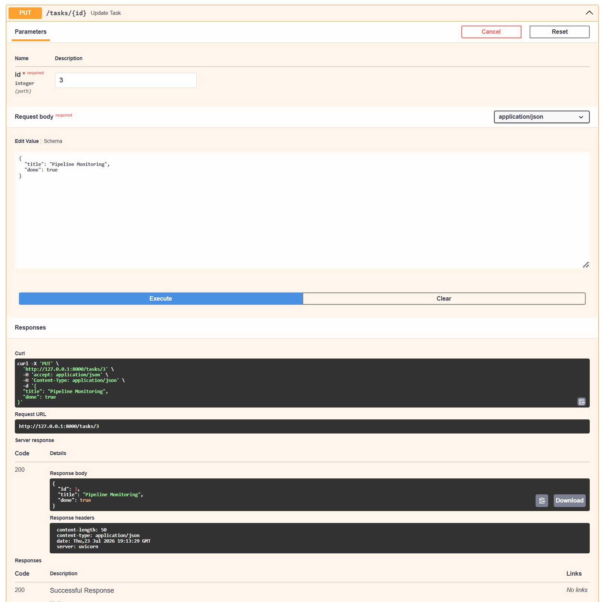

# Task API

A simple in-memory CRUD API for managing tasks, built with FastAPI.

## Features
- `GET /tasks` — list all tasks
- `GET /tasks/{id}` — get a single task
- `POST /tasks` — create a task
- `PUT /tasks/{id}` — update a task
- `DELETE /tasks/{id}` — delete a task
- `GET /health` — health check

## Run locally
```bash
pip install fastapi uvicorn
uvicorn main:app --reload
```
Visit `http://127.0.0.1:8000/docs` for interactive Swagger UI.

## API Docs (Swagger UI)

FastAPI auto-generates interactive docs at `/docs`, where every endpoint can be tested live.

**All endpoints:**


**Example — updating a task via `PUT /tasks/{id}`:**
